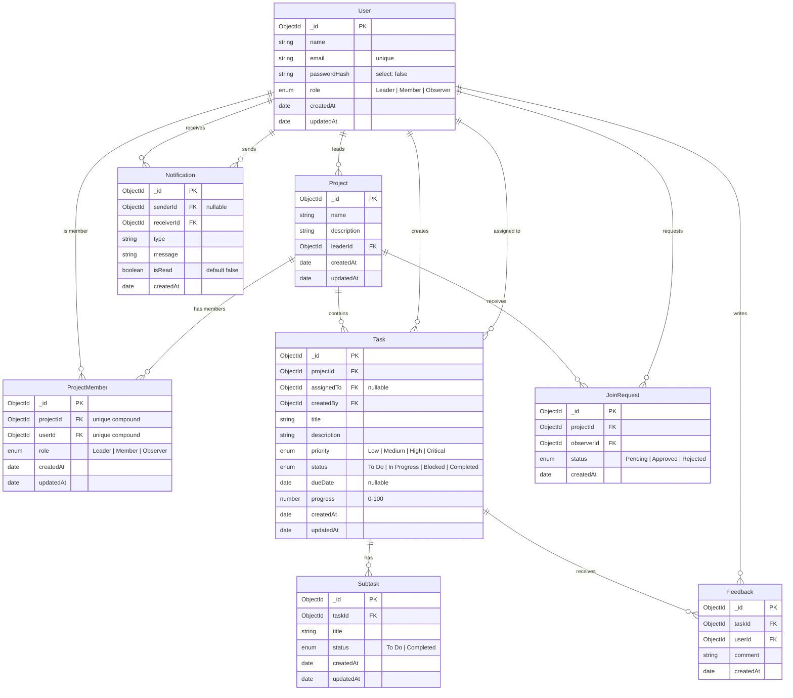
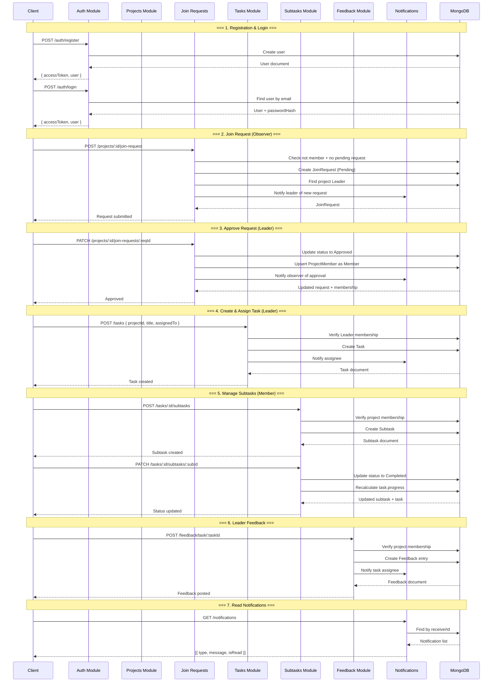
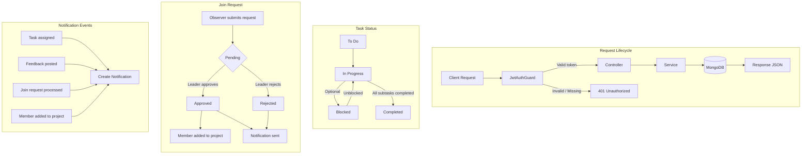

# Task Manager API — Architecture Diagrams

---

## 1. Entity Relationship Diagram (ERD)

---

## 2. Sequence Diagram — Full Project Lifecycle

---

## 3. Flowchart — System & Workflow Overview

---

## Database Indexes

| Collection | Index | Properties |
|---|---|---|
| `users` | `email` | unique |
| `projectmembers` | `(projectId, userId)` | unique compound |
| `joinrequests` | `(projectId, observerId, status)` | covered query for pending checks |
| `notifications` | `receiverId` | sort by `createdAt` desc |
| `tasks` | `projectId` | filter by project |
| `subtasks` | `taskId` | filter + count for progress |
| `feedback` | `taskId` | filter + sort by `createdAt` asc |
